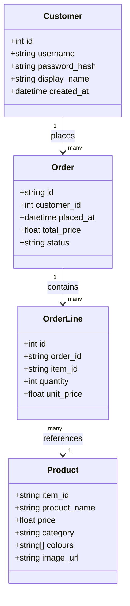

# Architecture — Furniture Buyer App

How the app is built. Kept in sync with the code as it grows.

## Proposed stack (beginner-friendly, revisit if needed)
- **Backend:** Python + **Flask** — small, readable, easy to add routes/templates.
- **Database:** **SQLite** for the app's own data (users, local orders) — a single file, zero setup. The
  authoritative catalogue/balance/orders live in the external shop API; SQLite holds users, sessions, and a
  local record of what this user did.
- **Frontend:** server-rendered HTML templates (Jinja) to start — simplest path to a working UI.
- **Auth:** session-based login (username + password hash).
- **Public URL:** a tunnel (e.g. ngrok) over the local dev server for the "internet-accessible" requirement.
- **External calls:** the shop API over HTTPS with an `X-Api-Key` header; key from `.env`.

> These are starting choices, not commitments — swap anything that turns out simpler.

## Entity model



**In plain English:** a **Customer** logs in and places **Orders**. Each Order has one or more **OrderLines**,
and each line refers to a **Product** from the shop catalogue. Product data (name, price, category, image)
originates from the external shop API/catalogue; the app stores what it needs to show history and reports.

## How the pieces talk (Level 2+)
```
Browser ──HTTP──> Flask app ──SQLite──> local users/orders
                     │
                     └──HTTPS (X-Api-Key)──> Shop API
                            GET  /catalogue/search-index   (browse)
                            GET  /users/{id}               (balance)
                            POST /orders                   (buy — real spend)
```

## Key rules (controller logic)
- Block an order whose total exceeds the user's remaining balance → clear "insufficient balance" message.
- All shop API errors map to friendly, user-facing messages (never a raw error).
- Secrets (`API_KEY`, base URL, any connection string) come from environment variables, never the source.

## Later
- **Level 3 agent:** a `/query`-style entry point that turns a plain-English request into shop API calls
  (tool-calling), confirming before any purchase.
- **Level 4 RAG:** embed the catalogue, retrieve by meaning, answer open-ended questions with citations.
